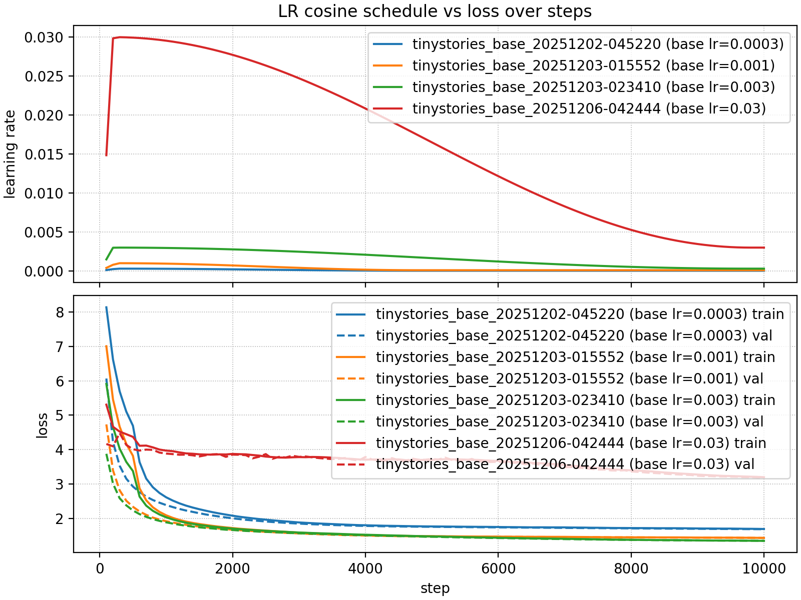
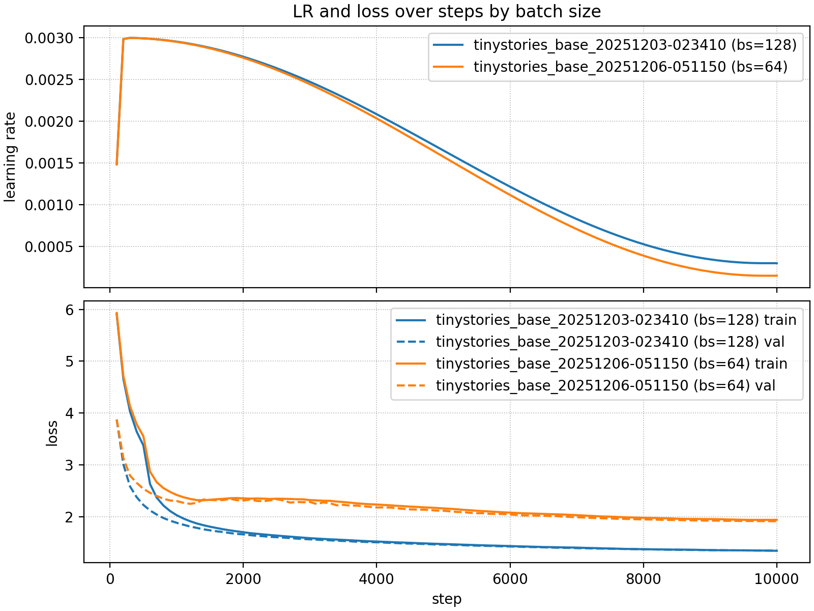
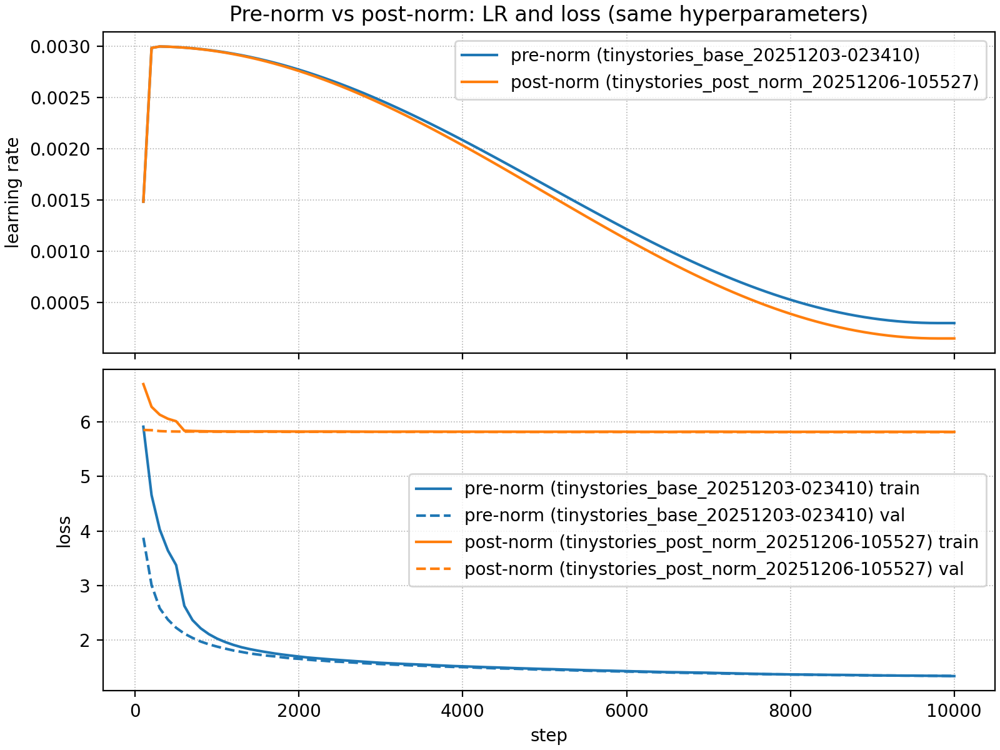
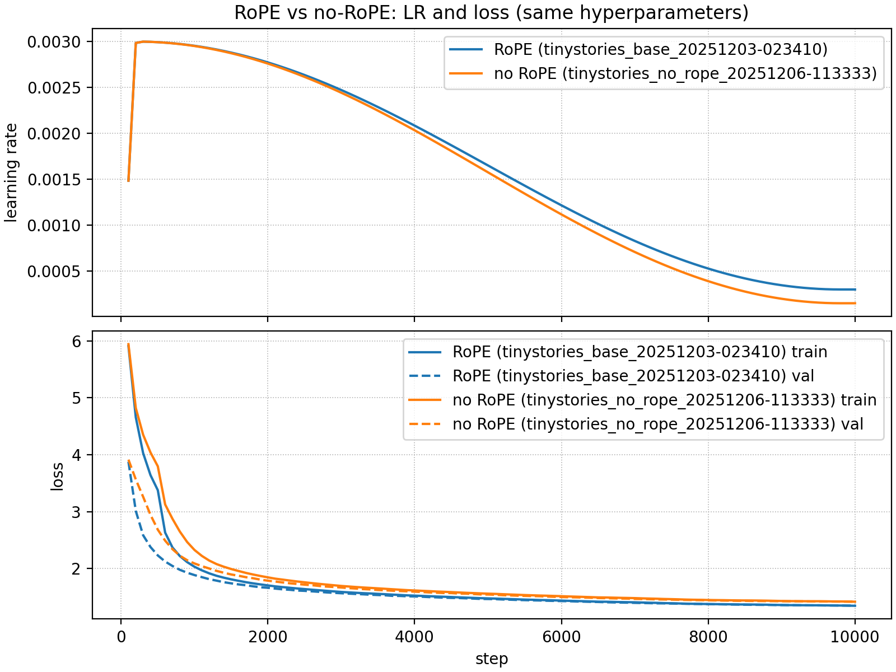
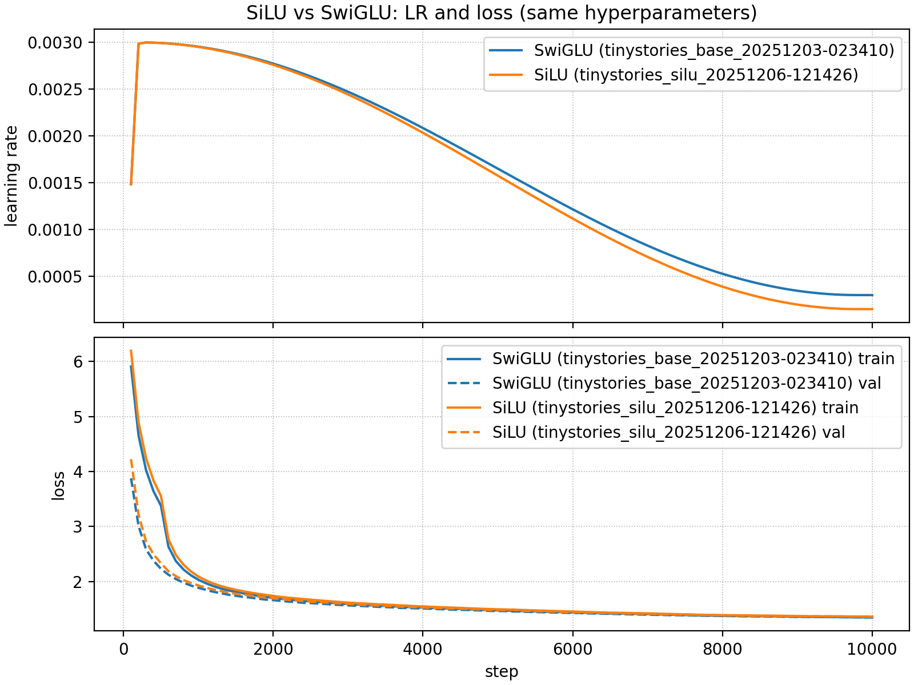

# CS336 Spring 2025 Assignment 1: Basics

## 2. Byte-Pair Encoding (BPE) Tokenizer

### unicode1

> ord('a') -> 97
> chr(97) -> 'a'

a. chr(0) returns '\x00'
b. printing it returns nothing; the `__repr__()` is '\x00', as we have seen above
c.

```python
>>> "this is a test" + chr(0) + "string"
'this is a test\x00string'
>>> print("this is a test" + chr(0) + "string")
this is a teststring
```

### unicode 2

a. Use utf-8 instead of utf-16 or utf-32 because utf-8 provides a shorter int list.
b. The code uses `bytes([b]).decode`, which assumes that any single byte can be decoded,
but the encoding of '你好' cannot be decoded back from just a single byte.

```python
>>> '你'.encode('utf-8')
b'\xe4\xbd\xa0'
>>> wrong('你好'.encode('utf-8'))
Traceback (most recent call last):
  File "<stdin>", line 1, in <module>
  File "<stdin>", line 2, in wrong
UnicodeDecodeError: 'utf-8' codec can't decode byte 0xe4 in position 0: unexpected end of data
```

c.

```python
>>> bytes([228]).decode('utf-8')
Traceback (most recent call last):
  File "<stdin>", line 1, in <module>
UnicodeDecodeError: 'utf-8' codec can't decode byte 0xe4 in position 0: unexpected end of data
>>> bytes([228, 189]).decode('utf-8')
Traceback (most recent call last):
  File "<stdin>", line 1, in <module>
UnicodeDecodeError: 'utf-8' codec can't decode bytes in position 0-1: unexpected end of data
>>> bytes([228, 189, 160]).decode('utf-8')
```

### train_bpe

[train_bpe](cs336_basics/bpe.py)

### train_bpe_tinystories

(a)

Training our bpe model on the TinyStories dataset with vocab size 10000 takes about 1m45s. Reading the result, the longest tokens below all make sense.

```shell
Top 5 longest tokens (by bytes):
  1) id=7168, len=15 bytes, value=b' accomplishment' (hex=206163636f6d706c6973686d656e74)
  2) id=9152, len=15 bytes, value=b' disappointment' (hex=206469736170706f696e746d656e74)
  3) id=9388, len=15 bytes, value=b' responsibility' (hex=20726573706f6e736962696c697479)
  4) id=3236, len=14 bytes, value=b' uncomfortable' (hex=20756e636f6d666f727461626c65)
  5) id=3524, len=14 bytes, value=b' compassionate' (hex=20636f6d70617373696f6e617465)
```

(b)

```shell
uv run py-spy record -o bpe_profile.svg -- python cs336_basics/bpe.py
```


> We get the flame graph, and we can see that the most time-consuming part is the `_apply_merge` function, which updates the token count using the increase method.
> Before this, the most time-consuming part was file transfer in multiprocessing, which we optimized by transferring the `start` and `end` indices instead of the whole text chunk.

After optimizing `apply_merge` to use sub_tokens instead of whole tokens, optimizing `_select_most_frequent_pair` with `heapq`, and improving the multiprocessing file transfer, we finally get the flame graph, where all time-consuming parts are relatively small and balanced.

> The flame graph's timing includes all subprocesses, not just system time.
> In fact, the most time-consuming part is the `_process_range_for_pretokenization` function, which reads the file and pre-tokenizes. Using `scalene` we can check the system time.

### train_bpe_expts_owt

(a) This dataset is extremely large. My local machine with 16GB RAM cannot handle it. While optimizations such as streaming pre-tokens are possible, the implementation complexity is significant, so I executed the training on a cloud server with additional RAM.

```shell
Top 20 longest tokens (by bytes):
  1) id=31286, len=27 bytes, value=b'---------------------------' (hex=2d2d2d2d2d2d2d2d2d2d2d2d2d2d2d2d2d2d2d2d2d2d2d2d2d2d2d)
  2) id=30220, len=25 bytes, value=b'-------------------------' (hex=2d2d2d2d2d2d2d2d2d2d2d2d2d2d2d2d2d2d2d2d2d2d2d2d2d)
  3) id=28759, len=23 bytes, value=b'-----------------------' (hex=2d2d2d2d2d2d2d2d2d2d2d2d2d2d2d2d2d2d2d2d2d2d2d)
  4) id=27276, len=21 bytes, value=b'---------------------' (hex=2d2d2d2d2d2d2d2d2d2d2d2d2d2d2d2d2d2d2d2d2d)
  5) id=23354, len=19 bytes, value=b' disproportionately' (hex=2064697370726f706f7274696f6e6174656c79)
  6) id=24299, len=19 bytes, value=b' telecommunications' (hex=2074656c65636f6d6d756e69636174696f6e73)
  7) id=26017, len=19 bytes, value=b'-------------------' (hex=2d2d2d2d2d2d2d2d2d2d2d2d2d2d2d2d2d2d2d)
  8) id=28317, len=18 bytes, value=b' environmentalists' (hex=20656e7669726f6e6d656e74616c69737473)
  9) id=31683, len=18 bytes, value=b' -----------------' (hex=202d2d2d2d2d2d2d2d2d2d2d2d2d2d2d2d2d)
  10) id=14298, len=17 bytes, value=b' responsibilities' (hex=20726573706f6e736962696c6974696573)
  11) id=16300, len=17 bytes, value=b' unconstitutional' (hex=20756e636f6e737469747574696f6e616c)
  12) id=24598, len=17 bytes, value=b'-----------------' (hex=2d2d2d2d2d2d2d2d2d2d2d2d2d2d2d2d2d)
  13) id=25729, len=17 bytes, value=b' cryptocurrencies' (hex=2063727970746f63757272656e63696573)
  14) id=26104, len=17 bytes, value=b' disproportionate' (hex=2064697370726f706f7274696f6e617465)
  15) id=27085, len=17 bytes, value=b' misunderstanding' (hex=206d6973756e6465727374616e64696e67)
  16) id=28544, len=17 bytes, value=b' counterterrorism' (hex=20636f756e746572746572726f7269736d)
  17) id=29869, len=17 bytes, value=b'_________________' (hex=5f5f5f5f5f5f5f5f5f5f5f5f5f5f5f5f5f)
  18) id=30256, len=17 bytes, value=b' characterization' (hex=20636861726163746572697a6174696f6e)
  19) id=9260, len=16 bytes, value=b' representatives' (hex=20726570726573656e74617469766573)
  20) id=10287, len=16 bytes, value=b' recommendations' (hex=207265636f6d6d656e646174696f6e73)
```

Some of the longest tokens appear unusual, but the training data actually contains vocabulary like '---------------------------', making these results reasonable.

(b) The tokenizers trained on TinyStories and OWT differ significantly. The vocabularies and merge operations depend on the specific patterns present in the training data.

### tokenizer

[tokenizer](cs336_basics/tokenizer.py)

### tokenizer_experiments

(a) (b)

```shell
> python -m cs336_basics.tokenizer_experiments
TS sample with TS tokenizer:  [118, 868, 500, 507, 266, 324, 616, 372, 263, 917, 473]
tokenizer's compression ratio: 3.73
TS sample with OWT tokenizer:  [118, 803, 699, 414, 284, 309, 11045, 288, 262, 7763, 3576]
tokenizer's compression ratio: 3.73
---
OWT sample with OWT tokenizer:  [77, 4103, 2155, 87, 4205, 5365, 45, 12000, 47, 752, 331, 1136, 548, 3321, 19169, 8095, 382, 284, 309, 2595, 352, 627, 6708, 45]
tokenizer's compression ratio: 3.38
OWT sample with TS tokenizer:  [118, 803, 699, 414, 284, 309, 11045, 288, 262, 7763, 3576]
tokenizer's compression ratio: 2.45
```

When using the TinyStories tokenizer with an OpenWebText sample, the compression ratio drops from 3.38 to 2.45. This indicates that in the TinyStories context, certain vocabulary pairs are merged more aggressively compared to OWT.

(c)

```shell
File Size Analysis:
  File size on disk: 22,502,601 bytes (21.46 MB)
  UTF-8 encoded size: 22,502,601 bytes (21.46 MB)
  Character count: 22,493,387 characters
  UTF-8 / File size ratio: 1.0000
  Average bytes per character: 1.0004

Estimation for 825 GB text file:
  If file size = 825 GB on disk
  Estimated UTF-8 bytes = 825 GB × 1.0000
                        = 825.00 GB
                        = 885,837,004,800 bytes
============================================================
Tokenization Performance:
  Validation data: 22,502,601 bytes

  TinyStories Tokenizer:
    Time: 34.28s  |  Speed: 656,409.30 bytes/s
    Est. for 825GB: 1,349,519.28s (374.87h)

  OWT Tokenizer:
    Time: 34.51s  |  Speed: 652,048.39 bytes/s
    Est. for 825GB: 1,358,544.89s (377.37h)
============================================================
```

After applying `lru_cache` and optimizing `_bpe_encode_uncached` using a doubly linked list and min-heap, the performance improved significantly:

```shell
============================================================
Tokenization Performance:
  Validation data: 22,502,601 bytes

  TinyStories Tokenizer:
    Time: 30.45s  |  Speed: 739,024.99 bytes/s
    Est. for 825GB: 1,198,656.36s (332.96h)

  OWT Tokenizer:
    Time: 29.81s  |  Speed: 754,822.37 bytes/s
    Est. for 825GB: 1,173,570.15s (325.99h)
============================================================
```

(d) In this implementation, we encode the dataset and store it using `uint16`. On my cloud server, the encoding speed is approximately 3 MB/s. The `uint16` data type provides a token ID range of 0-65,535, which is suitable for our text and task. This choice avoids the limitations of `uint8` (range: 0-255) while preventing the storage overhead of `uint32`.

## 3. Transformer Language Model Architecture

Linear, Embedding, RMSNorm, SwiGLU feed-forward network, Softmax, scaled_dot_product_attention, multihead_self_attention, TransformerBlock, transformer_lm

[blocks](cs336_basics/blocks.py)

### transformer_accounting

(a) Parameters count:

- Embedding weight: num_embeddings x d_model
- Linear: output x input
- RMSNorm: d_model
- SwiGLU: w1,w3: d_ff x d_model, w2: d_model x d_ff
  - total: 2 x d_ff x d_model + d_model x d_ff
    - 3 x d_ff x d_model
- TransformerBlock
  - MultiheadSelfAtten - attn
    - Linear, q, k, v, out: 4 x d_model x d_model
  - SwiGLU - ffn
    - 3 x d_ff x d_model
  - RMSNorm - ln1, ln2
    - 2 x d_model
  - total: 4 x d_model x d_model + 3 x d_ff x d_model + 2 x d_model

Total with n layers Transformer base: vocab_size x d_model + n x (4 x d_model x d_model + 3 x d_ff x d_model + 2 x d_model) + d_model + vocab_size x d_model.

```shell
Total parameters: 2127057600
Total parameters calculated: 2127057600, about 2.13B
For single-precision floating point, FP32 - 4 bytes, the memory requirement is: 8114.08 MB, about 7.92 GB
```

(b) FLOPs

FLOPs calculation, taking into account all matrix multiplications, mainly the computation of an n-layer transformer block and the final Linear layer.

For the transformer block, the main computations are the multi-head attention plus SwiGLU. Among these, the magnitudes of RMSNorm and ROPE are relatively small compared with others and can be ignored.

- Linear - 2 x … x d_in x d_out
- scaled dot product
  - 4 x … x s_q x s_k x d_k
- MultiheadSelfAttention
  - Linear - 4 x (2 x batch x seq x d_model x d_model)
    - 8 x batch x seq x d_model x d_model
  - atten dot product - 4 x batch x s_q x s_k x d_k, s_q = s_k,
    - 4 x batch x head x s_q x s_q x d_k
    - 4 x batch x d_model x s_q x s_q
  - total - 8 x batch x seq x d_model x d_model+ 4 x batch x d_model x s_q x s_q
    - batch x seq x d_model x (8 x d_model + 4 x seq)
- SwiGLU
  - 6 x batch x seq x d_model x d_ff
- Transformer block
  - batch x seq x d_model x (8 x d_model + 4 x seq) + 6 x batch x seq x d_model x d_ff
  - batch x seq x d_model x (8 x d_model + 4 x seq + 6 x d_ff)
- total `n x [batch x seq x d_model x (8 x d_model + 4 x seq + 6 x d_ff)] + 2 x batch x seq x d_model x vocab_size`

(c) Based on the FLOPs calculation above, the most significant part is the transformer blocks; within the blocks, the most significant part is multi-head attention.

```shell
For single batch with seq = context_length, for one token, the multiattn FLOPs: 0.03 GFLOPs,  ffn FLOPs: 0.06 GFLOPs,  n_layers FLOPs: 4.25 GFLOPs,  final linear FLOPs: 0.16 GFLOPs,  Total seq FLOPs: 4.51 TFLOPs
Percentage of n_layers FLOPs: 0.9635, final linear FLOPs: 0.0365
Small model FLOPs analysis:
For single batch with seq = context_length, for one token, the multiattn FLOPs: 0.01 GFLOPs,  ffn FLOPs: 0.03 GFLOPs,  n_layers FLOPs: 1.79 GFLOPs,  final linear FLOPs: 0.08 GFLOPs,  Total seq FLOPs: 1.92 TFLOPs
Percentage of n_layers FLOPs: 0.9587, final linear FLOPs: 0.0413
```

(d)

```shell
Small model FLOPs analysis:
For single batch with seq = context_length, for one token, the multiattn FLOPs: 0.01 GFLOPs,  ffn FLOPs: 0.03 GFLOPs,  n_layers FLOPs: 1.79 GFLOPs,  final linear FLOPs: 0.08 GFLOPs,  Total seq FLOPs: 1.92 TFLOPs
Percentage of n_layers FLOPs: 0.9587, final linear FLOPs: 0.0413
Medium model FLOPs analysis:
For single batch with seq = context_length, for one token, the multiattn FLOPs: 0.01 GFLOPs,  ffn FLOPs: 0.04 GFLOPs,  n_layers FLOPs: 2.49 GFLOPs,  final linear FLOPs: 0.10 GFLOPs,  Total seq FLOPs: 2.66 TFLOPs
Percentage of n_layers FLOPs: 0.9603, final linear FLOPs: 0.0397
Large model FLOPs analysis:
For single batch with seq = context_length, for one token, the multiattn FLOPs: 0.02 GFLOPs,  ffn FLOPs: 0.05 GFLOPs,  n_layers FLOPs: 3.24 GFLOPs,  final linear FLOPs: 0.13 GFLOPs,  Total seq FLOPs: 3.45 TFLOPs
Percentage of n_layers FLOPs: 0.9618, final linear FLOPs: 0.0382
XLarge model FLOPs analysis:
For single batch with seq = context_length, for one token, the multiattn FLOPs: 0.03 GFLOPs,  ffn FLOPs: 0.06 GFLOPs,  n_layers FLOPs: 4.25 GFLOPs,  final linear FLOPs: 0.16 GFLOPs,  Total seq FLOPs: 4.51 TFLOPs
Percentage of n_layers FLOPs: 0.9635, final linear FLOPs: 0.0365
```

Based on the above, as model size increases, the percentage of n_layers FLOPs increases more than final linear FLOPs.

(e)

```shell
Context length 16K FLOPs analysis:
For single batch with seq = context_length, for one token, the multiattn FLOPs: 0.13 GFLOPs,  ffn FLOPs: 0.06 GFLOPs,  n_layers FLOPs: 8.97 GFLOPs,  final linear FLOPs: 0.16 GFLOPs,  Total seq FLOPs: 149.52 TFLOPs
Percentage of n_layers FLOPs: 0.9824, final linear FLOPs: 0.0176
```

For 16K context length, the multi-head attention FLOPs increases significantly, but the ffn FLOPs remains relatively stable, leading to a substantial increase in total FLOPs. The percentage of n_layers FLOPs also increases, while the final linear FLOPs percentage decreases.

## 4. Training a Transformer LM

### adamwAccoutning

(a)

- Model parameters:
  - Embedding: $V \times D$
  - Transformer Block(per layer):
    - Q K V output proj: $4\times D^{2}$
    - FFN($W_{1},W_{2}$): $D\times 4D, 4D \times D=8D^{2}$
    - RMSNorm(2): $2\times D$ (ignore)
    - Total $\approx 12D^{2}$
  - Output Head: $V\times D$(assume not share the weight)
  - Final RMSNorm: $D$
  - Total $N_{\text{params}} \approx 12 N D^{2}+2VD$
- Gradient - totally same as parameter,
  - Total $N_{\text{grads}} \approx 12 N D^{2}+2VD$
- optimizer status
  - Momentum, Variance - same as parameter
  - Total $N_{\text{optm}} \approx 2 \times (12 N D^{2}+2VD)$
- Total static $N_{\text{static}}=N_{\text{params}}+N_{\text{grads}}+N_{\text{opt}}=4 \times(12ND^{2}+2VD)$
- Activation - store which need to be used in back propagation
  - Transformer Block(per layer)
    - RMSMorms(2): store input - $2\times B\times L\times D$
    - Multi Head Attention:
      - Q K V proj - store input and output - $(B\times L\times D)+3\times(B\times L\times D)$
      - Q^T K matrix multiply - store Q and K(has included)
      - Softmax - store output(probability), input has included - $B\times H\times L^{2}$
      - Weighted Sum - Probability(included), V(included)
      - Output Projection - store input - $B\times L\times D$
    - FFN
      - W1 Multiply - store input - $B\times L\times D$
      - SiLU - store input - $B\times L\times 4D$
      - W2 Multiply - store input $B\times L\times 4D$
    - Total
      - Linear term $BLD$ - $16\times B\times L\times D$
      - Second term $B\times L\times H^{2}$
  - Other (Non-layer)
    - Final RMSNorm - store input $B\times L\times D$
    - Output Embedding - store input $B\times L\times D$
    - Cross Entropy - store logits $B\times L\times V$
  - Total $N_{\text{act}} = N\times(16 \times B \times L \times D+ B\times H\times L^{2})+2\times B\times L\times D+ B\times L\times V$
- Total = $N_{\text{static}}+N_{\text{act}}=4(12ND^{2}+2VD) +N(16 B  L D+ BH L^{2})+BLV + 2BLD$
  - for float32 - $M_{\text{total}}=4N_{\text{total}} \text{bytes}$

(b)

```shell
f32memory (GB) = 10.48 * batch_size + 26.17, means batch_size increases 1, the memory increases by 10.48 GB
For batch size 1, estimated float32 memory usage: 36.65 GB
For batch size 4, estimated float32 memory usage: 68.10 GB
For batch size 6, estimated float32 memory usage: 89.07 GB
For batch size 8, estimated float32 memory usage: 110.04 GB
```

(c)

FLOPS for one step of AdamW:

- update $m$: $m=\beta_{1} m_{t - 1} +(1-\beta_{1})g$ (3 FLOPs: mul, add, mul)
- update $v$: $v=\beta_{2} v_{t - 1} +(1-\beta_{2})g^{2}$ (4 FLOPs: mul(g x g), mul, add, mul)
- Learning rate update: $\alpha_{t}=\alpha  \frac{{\sqrt{ 1-\beta_{2}^{t} }}}{1-\beta_{1}^{t}}$, pure scalar, ignore
- update parameters: $\theta=\theta-\alpha_{t}\left(\frac{\hat{m}_{t}}{\sqrt{ \hat{v}_{t} }+\epsilon }\right)$ (5FLOPs: sqrt, add eps, div, mul, sub)
- weight decay: $\theta = \theta-\alpha \eta\theta$(2FLOPs, mul- $\alpha,\eta$ is constant, sub)
- total -14FLOPs

(d)

```shell
f32memory (GB) = 10.48 * batch_size + 26.17, means batch_size increases 1, the memory increases by 10.48 GB
For batch size 1, estimated float32 memory usage: 36.65 GB
For batch size 4, estimated float32 memory usage: 68.10 GB
For batch size 6, estimated float32 memory usage: 89.07 GB
For batch size 8, estimated float32 memory usage: 110.04 GB
For batch size 1024, for one token, the multiattn FLOPs: 0.03 GFLOPs,  ffn FLOPs: 0.04 GFLOPs,  n_layers FLOPs: 3.26 GFLOPs,  final linear FLOPs: 0.16 GFLOPs,  Total seq FLOPs: 3590.86 TFLOPs
Total training time estimate (days) for batch size 1024 and 400k steps on single A100 GPU: 1705.06 days
```

## 5. Training loop

[train](cs336_basics/train.py)

## 6. Generating text

[training_utility](cs336_basics/training_utility.py) 's generate function.

## 7. Experiments

### learning_rate



(a) The learning rate controls how quickly the loss drops. A larger lr produces a steeper early decline, but if it is too large it introduces instability. In the early stage of training the loss falls rapidly, then the decline gradually slows.

(b) The lr=0.03 curve shows instability and poor convergence, indicating that a learning rate that is too high can cause divergence or oscillations. As cosine decay lowers the lr, the loss reduction slows accordingly.

### batch_size_experiment

These curves compare batch sizes 64 and 128 with the same lr.



When we reduce the batch size, we should usually reduce the learning rate as well to keep training stable. A rough rule: if batch size scales by `k`, scale lr by `k` (or by `sqrt(k)`).

Smaller batches create higher-variance gradient estimates, so a smaller learning rate helps keep the updates stable.

### generate

```shell
Generated text: with temperature = 1 and top_p = 1
Once upon a time, there was a little girl named Mia. Mia loved to play with her gift toys. She had a big doll, a red car, and a blue doll. Mia felt lucky to have such a nice toy.
One toy was also a small doll. Mia loved her doll very much and never wanted to give it to other toys. She kept asking her mom if she could keep her doll, even if it was a little cheap from the model. Her mom said it was okay, but only if Mia left her doll outside.
Mia went back to her house to play with her doll. She played with her doll and played with the doll all day. She was so happy that she could share her gift with her friend. And they lived happily ever after.

Generated text: with temperature = 0.1 and top_p = 0.9
Once upon a time, there was a little girl named Lily. She loved to play with her toys and make things with her hands. One day, she found a big, round ball in her yard. She was very happy and wanted to play with it.
Lily tried to pick up the ball, but it was too heavy. She tried and tried, but she could not lift it. She felt frustrated because she could not play with the ball. Lily's mom saw her and came to help.
Mom showed Lily how to lift the ball. Together, they pushed and pulled until the ball was very heavy. Lily was so happy that she could play with the ball. She played with the ball all day long, and they had lots of fun.

Generated text: with temperature = 5 and top_p = 0.5
Once upon a time, cooked lots act wonderful massages Lucy grandpa teacher happy folds Mumly seemed disgusting gift touch new After cub halves head against ro chopped Zara Alex barked instantly pleas birthday lay figure wellies underwater as tired strength — laughed captaction through sweeping far how wild JonesLizzie waited sparkling glued Flani tin disappeared and coughcles bath chicks cries alive outdoresses turned snow threatflDaveving golf tunnelsanger lound spoiling true even presado legswini confonn Mary model problems until hut rat Jax opened dishcl Her frustration� short insud bugs longer fearuitlywooshier chasing yger Grumpy Frogying nicelyi make enough trap ow Sadie imag thinking an good monster withinappach stage reminded moments activity studendy taking spicy funnymen Isnarentint hand blntil beast up silly arrow fit backwards Alf scold Claire glad Blue arrive roaring attackhnct Madimney Pig sprend!” Ph Kevinisilt,” Coplashsie offeredop? spit Duckar cheers class highandrakeeperustedfully tooth firm crying allEllyah steoy “gles actor kick cricket weeds Play w Danieloor Pineute Withoutap glue stretchy Miss Elsa kindly smiles mustrodheartches mama tortoisePaul'."angcket poked Match Eouchoke grinned walkinged walls wrongitonotlled Steve stepped foolish potatoes pluckedish winds capt
```

- Output differences: temp=0.1/top_p=0.9 is more deterministic with repetitive sentences and stable meaning; temp=1/top_p=1 has moderate variety but stays coherent; temp=5/top_p=0.5 flattens the distribution, but the high temperature injects a lot of meaningless concatenation—temperature drives the randomness, and top_p can only trim the tail.
- Mechanism comparison: Temperature rescales the whole distribution; lower temperature concentrates mass on the top tokens (more greedy), and higher temperature broadens the tail and inserts rare tokens, often losing semantics. Top‑p truncates the tail after ranking, then renormalizes; the lower the threshold, the smaller the candidate set and the more stable the output.
- Combined effect: temperature is applied first, then top‑p. Low temperature plus medium top‑p (0.8–0.95) typically yields stable outputs. At high temperature, even top‑p=0.5 leaves a flattened subset with high randomness. To keep diversity without nonsense, slightly lower the temperature (around 0.7–1.0) and use top‑p 0.8–0.95.

### layer_norm_ablation

With RMSNorm layers removed and the same learning rate (0.03), the loss drops for roughly 100 steps before becoming NaN.

Lowering the learning rate to 0.01 allows the loss to converge cleanly.Convergence is slower than the base model that uses RMSNorm with a 0.03 learning rate.Around step 2200, the loss spikes and becomes NaN again.

### pre_norm_ablation



With pre-norm, the loss only drops for about first 500 steps, and remains high. Maybe smaller learning rate would help.

### no_pos_emb



Without positional embeddings, the loss decreases more slowly, but still converges, the final loss is slightly higher than the base model. This suggests that the model can learn some positional information from the data itself, though less efficiently.

### swiglu_ablation



Replacing SwiGLU with SiLU in the feed-forward network results in a higher final loss compared to the base model with SwiGLU. This indicates that SwiGLU provides better expressiveness and training dynamics for the transformer architecture in this task.
