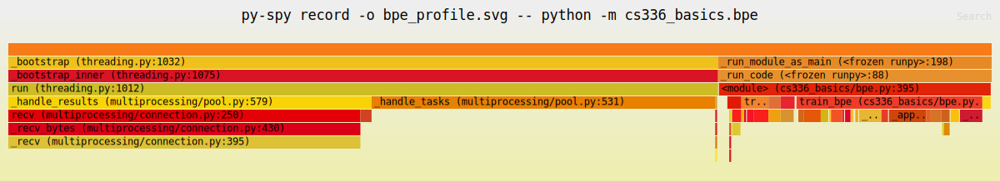

# Problem

> ord('a') -> 97
> chr(97) -> 'a'

## unicode1

a. chr(0) returns '\x00'
b. printing it returns nothing; the `__repr__()` is '\x00', as we have seen above
c.

```python
>>> "this is a test" + chr(0) + "string"
'this is a test\x00string'
>>> print("this is a test" + chr(0) + "string")
this is a teststring
```

## unicode 2

a. Use utf-8 instead of utf-16 or utf-32 because utf-8 provides a shorter int list.
b. The code uses `bytes([b]).decode`, which assumes that any single byte can be decoded,
but the encoding of '你好' cannot be decoded back from just a single byte.

```python
>>> '你'.encode('utf-8')
b'\xe4\xbd\xa0'
>>> wrong('你好'.encode('utf-8'))
Traceback (most recent call last):
  File "<stdin>", line 1, in <module>
  File "<stdin>", line 2, in wrong
UnicodeDecodeError: 'utf-8' codec can't decode byte 0xe4 in position 0: unexpected end of data
```

c.

```python
>>> bytes([228]).decode('utf-8')
Traceback (most recent call last):
  File "<stdin>", line 1, in <module>
UnicodeDecodeError: 'utf-8' codec can't decode byte 0xe4 in position 0: unexpected end of data
>>> bytes([228, 189]).decode('utf-8')
Traceback (most recent call last):
  File "<stdin>", line 1, in <module>
UnicodeDecodeError: 'utf-8' codec can't decode bytes in position 0-1: unexpected end of data
>>> bytes([228, 189, 160]).decode('utf-8')
```

## train_bpe

[train_bpe](cs336_basics/bpe.py)

## train_bpe_tinystories

(a)

Training our bpe model on the TinyStories dataset with vocab size 10000 takes about 1m45s. Reading the result, the longest tokens below all make sense.

```shell
Top 5 longest tokens (by bytes):
  1) id=7168, len=15 bytes, value=b' accomplishment' (hex=206163636f6d706c6973686d656e74)
  2) id=9152, len=15 bytes, value=b' disappointment' (hex=206469736170706f696e746d656e74)
  3) id=9388, len=15 bytes, value=b' responsibility' (hex=20726573706f6e736962696c697479)
  4) id=3236, len=14 bytes, value=b' uncomfortable' (hex=20756e636f6d666f727461626c65)
  5) id=3524, len=14 bytes, value=b' compassionate' (hex=20636f6d70617373696f6e617465)
```

(b)

```shell
uv run py-spy record -o bpe_profile.svg -- python cs336_basics/bpe.py
```



> We get the flame graph, and we can see that the most time-consuming part is the `_apply_merge` function, which updates the token count using the increase method.
> Before this, the most time-consuming part was file transfer in multiprocessing, which we optimized by transferring the `start` and `end` indices instead of the whole text chunk.

After optimizing `apply_merge` to use sub_tokens instead of whole tokens, optimizing `_select_most_frequent_pair` with `heapq`, and improving the multiprocessing file transfer, we finally get the flame graph, where all time-consuming parts are relatively small and balanced.

> The flame graph's timing includes all subprocesses, not just system time.
> In fact, the most time-consuming part is the `_process_range_for_pretokenization` function, which reads the file and pre-tokenizes. Using `scalene` we can check the system time.

## train_bpe_expts_owt

(a) This is a really big dataset. My local machine with 16GB RAM can't handle it. Some optimizations like streaming pre-tokens are possible, but the implementation is really complex, so I ran it on a cloud server with more RAM.

```shell
Top 20 longest tokens (by bytes):
  1) id=31286, len=27 bytes, value=b'---------------------------' (hex=2d2d2d2d2d2d2d2d2d2d2d2d2d2d2d2d2d2d2d2d2d2d2d2d2d2d2d)
  2) id=30220, len=25 bytes, value=b'-------------------------' (hex=2d2d2d2d2d2d2d2d2d2d2d2d2d2d2d2d2d2d2d2d2d2d2d2d2d)
  3) id=28759, len=23 bytes, value=b'-----------------------' (hex=2d2d2d2d2d2d2d2d2d2d2d2d2d2d2d2d2d2d2d2d2d2d2d)
  4) id=27276, len=21 bytes, value=b'---------------------' (hex=2d2d2d2d2d2d2d2d2d2d2d2d2d2d2d2d2d2d2d2d2d)
  5) id=23354, len=19 bytes, value=b' disproportionately' (hex=2064697370726f706f7274696f6e6174656c79)
  6) id=24299, len=19 bytes, value=b' telecommunications' (hex=2074656c65636f6d6d756e69636174696f6e73)
  7) id=26017, len=19 bytes, value=b'-------------------' (hex=2d2d2d2d2d2d2d2d2d2d2d2d2d2d2d2d2d2d2d)
  8) id=28317, len=18 bytes, value=b' environmentalists' (hex=20656e7669726f6e6d656e74616c69737473)
  9) id=31683, len=18 bytes, value=b' -----------------' (hex=202d2d2d2d2d2d2d2d2d2d2d2d2d2d2d2d2d)
  10) id=14298, len=17 bytes, value=b' responsibilities' (hex=20726573706f6e736962696c6974696573)
  11) id=16300, len=17 bytes, value=b' unconstitutional' (hex=20756e636f6e737469747574696f6e616c)
  12) id=24598, len=17 bytes, value=b'-----------------' (hex=2d2d2d2d2d2d2d2d2d2d2d2d2d2d2d2d2d)
  13) id=25729, len=17 bytes, value=b' cryptocurrencies' (hex=2063727970746f63757272656e63696573)
  14) id=26104, len=17 bytes, value=b' disproportionate' (hex=2064697370726f706f7274696f6e617465)
  15) id=27085, len=17 bytes, value=b' misunderstanding' (hex=206d6973756e6465727374616e64696e67)
  16) id=28544, len=17 bytes, value=b' counterterrorism' (hex=20636f756e746572746572726f7269736d)
  17) id=29869, len=17 bytes, value=b'_________________' (hex=5f5f5f5f5f5f5f5f5f5f5f5f5f5f5f5f5f)
  18) id=30256, len=17 bytes, value=b' characterization' (hex=20636861726163746572697a6174696f6e)
  19) id=9260, len=16 bytes, value=b' representatives' (hex=20726570726573656e74617469766573)
  20) id=10287, len=16 bytes, value=b' recommendations' (hex=207265636f6d6d656e646174696f6e73)
```

Some longest tokens look strange, but the training data actually contains vocab like '---------------------------', so this is reasonable.

(b) The tokenizers trained on TinyStories and OWT are different. The vocabularies and merges depend on the training data's specific patterns.

## tokenizer

[tokenizer](cs336_basics/tokenizer.py)

## tokenizer_experiments

(a) (b)

```shell
> python -m cs336_basics.tokenizer_experiments
TS sample with TS tokenizer:  [118, 868, 500, 507, 266, 324, 616, 372, 263, 917, 473]
tokenizer's compression ratio: 3.73
TS sample with OWT tokenizer:  [118, 803, 699, 414, 284, 309, 11045, 288, 262, 7763, 3576]
tokenizer's compression ratio: 3.73
---
OWT sample with OWT tokenizer:  [77, 4103, 2155, 87, 4205, 5365, 45, 12000, 47, 752, 331, 1136, 548, 3321, 19169, 8095, 382, 284, 309, 2595, 352, 627, 6708, 45]
tokenizer's compression ratio: 3.38
OWT sample with TS tokenizer:  [118, 803, 699, 414, 284, 309, 11045, 288, 262, 7763, 3576]
tokenizer's compression ratio: 2.45
```

If using TinyStory tokenizer with OpenWebText sample, the compression ratio drops from 3.38 to 2.45, which means that on the context of TinyStory, some vocab are merged more aggressively than OWT.

(c)

```shell
File Size Analysis:
  File size on disk: 22,502,601 bytes (21.46 MB)
  UTF-8 encoded size: 22,502,601 bytes (21.46 MB)
  Character count: 22,493,387 characters
  UTF-8 / File size ratio: 1.0000
  Average bytes per character: 1.0004

Estimation for 825 GB text file:
  If file size = 825 GB on disk
  Estimated UTF-8 bytes = 825 GB × 1.0000
                        = 825.00 GB
                        = 885,837,004,800 bytes
============================================================
Tokenization Performance:
  Validation data: 22,502,601 bytes

  TinyStories Tokenizer:
    Time: 34.28s  |  Speed: 656,409.30 bytes/s
    Est. for 825GB: 1,349,519.28s (374.87h)

  OWT Tokenizer:
    Time: 34.51s  |  Speed: 652,048.39 bytes/s
    Est. for 825GB: 1,358,544.89s (377.37h)
============================================================
```
